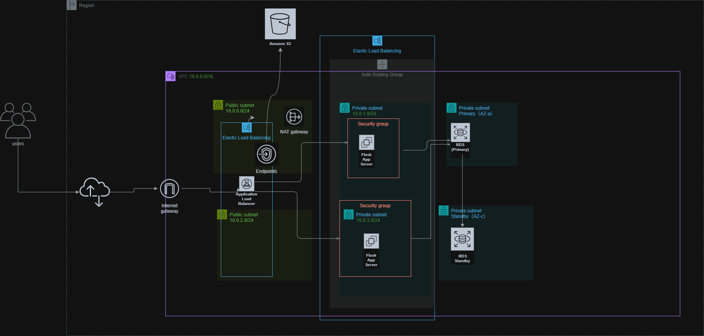
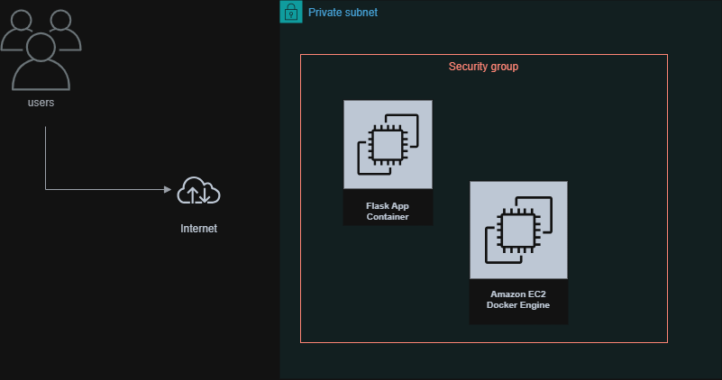

# AWS 3-Tier Architecture (Wine Inventory App)
本プロジェクトは、AWS 上に構築した Web 3 層アーキテクチャ上で Flask を用いた
ワイン在庫管理（棚卸）アプリケーションを動作させる構成を Terraform によって IaC 化したものです。

本アプリケーションは、RDS（MySQL）に保存されたワイン情報（在庫数・原価・売値・原価率など）を管理し、
Web UI（Flask）から登録・更新・削除・一覧表示を行うことができます。

## 主な構成要素

- **ALB（Application Load Balancer）**
  - Flask アプリへのルーティングを担当

- **EC2（Flask + Gunicorn + nginx）**
  - アプリケーションサーバ

- **RDS（MySQL）**
  - ワイン情報の永続化

- **S3**
  - ワインラベル画像の保存

- **VPC（Public / Private Subnets）**
  - AWS ベストプラクティスに準拠したネットワーク構成

## AWS Architecture (3-Tier)

## EC2 Internal Architecture (Docker)

